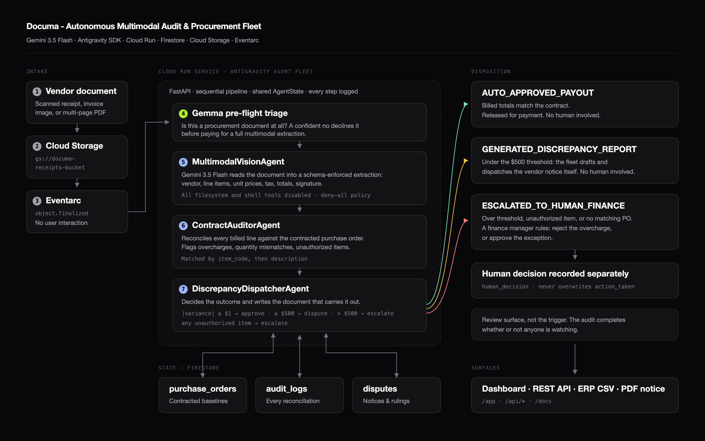

# Documa - Autonomous Multimodal Audit & Procurement Fleet

**Google All Things Agentic Hackathon - The Taskmaster track**

**Live:** https://documa-fleet-466418539031.us-central1.run.app &nbsp;·&nbsp; [Dashboard](https://documa-fleet-466418539031.us-central1.run.app/app) &nbsp;·&nbsp; [Docs](https://documa-fleet-466418539031.us-central1.run.app/docs)

Documa reads vendor documents, audits them line by line against your contracted purchase
orders, and then clears, disputes, or escalates each one. It is a background workflow, not a
chatbot: a file landing in a bucket is the trigger, and most documents are resolved before a
person ever opens them.



---

## The problem

You agreed to buy 10 monitors at **$180** each. That agreement is purchase order **PO-9921**.
The vendor invoices you at **$210** each. Someone in finance has to open the invoice, find the
PO, compare every line, spot the $30-per-unit markup, and write the dispute. Multiply by
hundreds of invoices a month.

Documa does that reconciliation itself and surfaces only what genuinely needs a signature.

| Outcome | When | Human involved |
| :--- | :--- | :--- |
| `AUTO_APPROVED_PAYOUT` | No discrepancies, variance within $1 | No |
| `GENERATED_DISCREPANCY_REPORT` | Discrepancies, variance ≤ $500, nothing unauthorized | No |
| `ESCALATED_TO_HUMAN_FINANCE` | Variance > $500, unauthorized item, or no matching PO | Yes |

The **$500 threshold is the autonomy boundary**. Below it Documa resolves the dispute itself;
above it, it defers. The fleet knows the limit of its own authority.

---

## Architecture

```
Cloud Storage (document lands)
  -> Eventarc  object.finalized
  -> Cloud Run worker
      -> Gemma pre-flight triage      is this a procurement document at all?
      -> MultimodalVisionAgent        Gemini 3.5 Flash reads it into structured data
      -> ContractAuditorAgent         reconciles every line against the PO in Firestore
      -> DiscrepancyDispatcherAgent   approves, disputes, or escalates
  -> Firestore  audit log + dispute record
```

Three agents run as a sequential pipeline on the **official Google Antigravity SDK** harness,
each handing typed state to the next through a shared `AgentState`. An orchestrator records
every step in an execution log returned with the response.

### Stack

| Layer | Technology |
| :--- | :--- |
| Vision model | **Gemini 3.5 Flash** (`gemini-3.5-flash`) via Gemini API or Vertex AI |
| Triage model | **Gemma** (`gemma-4-26b-a4b-it-maas`) via the Google GenAI SDK |
| Registry | **Artifact Registry** + **Cloud Build** for the deployment pipeline |
| Agent framework | **Antigravity SDK** (`google-antigravity`) - schema-enforced structured output |
| Compute | **Google Cloud Run** (Docker, `python:3.11-slim`, port 8080) |
| State | **Google Firestore** - `purchase_orders`, `audit_logs`, `disputes` |
| Document store | **Google Cloud Storage** - `gs://documa-receipts-bucket` |
| Triggers | **Google Eventarc** - `object.finalized` |
| Service | Python 3.11+, FastAPI, Uvicorn, Pydantic v2 |
| Frontend | Hand-written HTML/CSS - no framework, no CDN, no build step |

Every Google dependency degrades gracefully: with no credentials, Firestore and Cloud Storage
fall back to in-memory and local-disk equivalents, so the whole system runs offline.

---

## Quick start

### Local

```bash
git clone https://github.com/mrnetwork0001/Documa.git
cd Documa

python3 -m venv venv && source venv/bin/activate
pip install -r requirements.txt

cp .env.example .env          # then paste your key into .env (gitignored)

PYTHONPATH=. uvicorn documa.server:app --port 8085
```

| Page | URL |
| :--- | :--- |
| Landing | http://localhost:8085/ |
| Dashboard | http://localhost:8085/app |
| Documentation | http://localhost:8085/docs |
| OpenAPI explorer | http://localhost:8085/openapi-docs |

### Run the fleet from the CLI

```bash
PYTHONPATH=. python main.py                        # all four audit scenarios
PYTHONPATH=. pytest tests/test_audit_fleet.py -v   # test suite
```

### Docker, or any VPS

The container carries nothing GCP-specific, so it runs anywhere Docker does:

```bash
docker build -t documa .
docker run -d -p 80:8080 -e GEMINI_API_KEY="your-key" --restart unless-stopped documa
```

Without Firestore credentials, state is in-memory and does not survive a restart.

### Vertex AI with Application Default Credentials

If your organisation disallows API keys, authenticate with ADC instead - no key
is stored anywhere:

```bash
gcloud auth login
gcloud config set project YOUR_PROJECT_ID
gcloud auth application-default login
gcloud auth application-default set-quota-project YOUR_PROJECT_ID
gcloud services enable aiplatform.googleapis.com
```

Then in `.env`:

```
GOOGLE_GENAI_USE_VERTEXAI=true
GOOGLE_CLOUD_PROJECT=your-project-id
GOOGLE_CLOUD_LOCATION=global
```

Two things bite here. The **quota project** must be set explicitly, or requests
are attributed to a shared Google project and every model returns 404. And
Gemini 3.x publisher models are served from **`global`**, not a regional
endpoint - `us-central1` returns 404 for `gemini-3.5-flash`.

### Google Cloud Run

```bash
export GOOGLE_CLOUD_PROJECT="your-project-id"
export GCP_REGION="us-central1"
./deploy.sh          # enables APIs, builds via Cloud Build, deploys to Cloud Run
```

To wire up the autonomous path, point Eventarc at the service:

```bash
gsutil mb -l us-central1 gs://documa-receipts-bucket

gcloud eventarc triggers create documa-intake \
  --destination-run-service=documa-fleet \
  --destination-run-path=/api/events/gcs \
  --destination-run-region=us-central1 \
  --event-filters="type=google.cloud.storage.object.v1.finalized" \
  --event-filters="bucket=documa-receipts-bucket" \
  --location=us-central1

# Drop a document in and walk away
gsutil cp receipts/overcharged_invoice.png gs://documa-receipts-bucket/
```

---

## Configuration

| Variable | Purpose |
| :--- | :--- |
| `GEMINI_API_KEY` | Gemini API key. `GOOGLE_API_KEY` is accepted as an alias. |
| `GOOGLE_GENAI_USE_VERTEXAI` | Truthy routes the model through Vertex AI instead of the Gemini API. |
| `GOOGLE_CLOUD_PROJECT` | Project for Firestore and Vertex AI. Defaults to `documa-hackathon`. |
| `GOOGLE_CLOUD_LOCATION` | Vertex region. Use `global` for Gemini 3.x - regional endpoints return 404. |
| `GCS_BUCKET_NAME` | Document bucket. Defaults to `documa-receipts-bucket`. |
| `DOCUMA_STRICT_MODE` | Truthy makes a failed or unavailable extraction **raise** instead of falling back. |
| `DOCUMA_TRIAGE_MODEL` | Gemma model for pre-flight triage. Defaults to `gemma-4-26b-a4b-it-maas`. |
| `DOCUMA_DISABLE_TRIAGE` | Truthy skips triage entirely. |

### Strict mode

Without an API key Documa runs on offline fixtures so the pipeline stays demonstrable - but
nothing is actually read from the document. Every result therefore carries an
`extraction_mode` of `ANTIGRAVITY_GEMINI` or `SIMULATED_FALLBACK`, surfaced through the API
and shown in the dashboard as a badge.

**Run demos with `DOCUMA_STRICT_MODE=true`.** Documa then refuses to fall back, so every figure
on screen is provably a live extraction.

```bash
DOCUMA_STRICT_MODE=true GEMINI_API_KEY="your-key" \
  PYTHONPATH=. uvicorn documa.server:app --port 8085
```

---

## HTTP API

| Endpoint | Purpose |
| :--- | :--- |
| `POST /api/audit/process` | Audit a document by path or GCS URI |
| `POST /api/audit/upload` | Multipart upload, then audit |
| `POST /api/events/gcs` | Eventarc `object.finalized` handler |
| `GET/POST /api/po` | List / create purchase orders |
| `GET /api/audit/logs` | Audit history |
| `GET /api/disputes` | Dispute reports |
| `POST /api/disputes/{id}/approve` | Record a human finance decision |
| `GET /api/disputes/{id}/export/pdf` | Printable vendor dispute notice |
| `GET /api/audit/export/csv` | ERP-compatible CSV (SAP / QuickBooks) |

```bash
curl -X POST http://localhost:8085/api/audit/process \
  -H 'Content-Type: application/json' \
  -d '{"document_id":"DOC-MINOR-404",
       "file_path_or_url":"receipts/minor_overcharge_invoice.png",
       "po_number_override":"PO-9921"}'
```

---

## Demo scenarios

Measured against **PO-9921** (10 monitors at $180, 5 chairs at $250, approved total $3,250):

| Document | Billed | Variance | Outcome |
| :--- | ---: | ---: | :--- |
| `compliant_invoice.png` | $3,250.00 | $0.00 | `AUTO_APPROVED_PAYOUT` |
| `minor_overcharge_invoice.png` | $3,550.00 | +$300.00 | `GENERATED_DISCREPANCY_REPORT` |
| `unauthorized_fees_invoice.png` | $3,700.00 | +$450.00 | `ESCALATED_TO_HUMAN_FINANCE` |
| `overcharged_invoice.png` | $4,400.00 | +$1,150.00 | `ESCALATED_TO_HUMAN_FINANCE` |

The minor-overcharge case is the clearest demonstration of autonomy: a real overcharge caught,
disputed, and formally resolved with nobody in the loop.

---

## Engineering notes

- **An invoice is untrusted input.** The Antigravity harness enables filesystem and shell tools
  by default; Documa disables all twelve non-terminal tools behind a deny-all policy, so the
  vision agent can only perform inference. The prompt also instructs the model to treat
  document text as data, never as instructions.
- **Cheap triage before expensive vision.** An open Gemma model screens each document first.
  A confident "not a procurement document" declines it before a full multimodal extraction is
  paid for. Triage is advisory - failure or unavailability never blocks an audit.
- **Sync/async bridge.** The Antigravity SDK is async-only while the fleet is synchronous. The
  bridge works both off the event loop (CLI, tests, FastAPI `def` endpoints) and on it, where a
  bare `asyncio.run` would raise.
- **Fail visibly, not plausibly.** Documents matching no fixture are reported as `UNKNOWN` at
  $0.00 with zero confidence rather than being given invented invoice data.
- **The agent's record is immutable.** A finance manager's override is written to a separate
  `human_decision` field, so `action_taken` remains an accurate account of what the fleet did.

## Not production-hardened

This is a hackathon build. CORS is open to all origins and no endpoint carries authentication,
including the finance override. Put it behind your own auth before pointing it at real
procurement data.

---

## License

[Apache 2.0](LICENSE) · Author: Ifeanyichukwu Onwo ([mrnetwork0001](https://github.com/mrnetwork0001))
